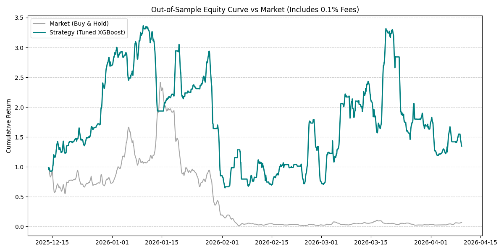

# Quantitative ML Trading Pipeline (BTC/USDT)

## Overview
This repository implements a machine learning pipeline for classifying cryptocurrency trading signals. Developed with a focus on **industrial reliability** and **rigorous validation**, the system addresses the primary challenges in quantitative finance: data leakage, lookahead bias, class imbalance, and non-stationary market regimes.

## Key Features
- **Data Ingestion**: Robust pagination through the Binance API via `ccxt`, handling rate limits and data integrity.
- **Walk-Forward Validation**: A strict out-of-sample backtesting framework that simulates real-world trading by moving the training window forward in time.
- **Nested Cross-Validation & Model Zoo**: Hyperparameter tuning is strictly isolated within the training folds using `TimeSeriesSplit`. Compares Linear Baselines, Random Forest, dynamically tuned XGBoost, and SOTA PyTorch Sequence models.
- **Leakage Prevention (Purged Walk-Forward)**: Implements standard Purging (inspired by Marcos López de Prado). We explicitly drop training samples whose lookahead windows overlap with the out-of-sample test set to guarantee zero data leakage.
- **Class Imbalance Handling**: Dynamic class and sample weighting force the models to focus on actionable minority classes (Buy/Sell) rather than defaulting to the majority class (Hold).
- **Risk Management & Position Sizing**: Translates model confidence (`predict_proba`) into dynamic position sizes. Capital allocation is scaled inversely by volatility (ATR) and directly by the model's probabilistic certainty, mimicking institutional Kelly-criterion implementations.
- **Financial Backtesting & Realistic PnL**: Goes beyond ML metrics (F1-Score) to calculate actionable financial metrics. The out-of-sample backtest factors in **0.1% Binance maker/taker fees**, computing the Sharpe Ratio, Max Drawdown, and Win Rate to prove strategy viability.

## Technical Architecture
1. `data_fetcher.py`: Automated OHLCV retrieval and Parquet storage.
2. `features.py`: Advanced feature engineering including:
    - **Momentum/Volume**: RSI, MACD, OBV.
    - **Statistical Moments**: Rolling Skewness & Kurtosis to capture non-normal return distributions.
    - **Market Regimes**: Unsupervised Gaussian Mixture Models (GMM) to classify high vs. low volatility states.
3. `labels.py`: Classification targeting using a triple-barrier-style volatility adjusted approach.
4. `models.py`: Deep Learning sequence models (Gated Recurrent Units / GRU) with sliding lookback windows to capture temporal market memory, optimized with AdamW and gradient clipping.
5. `portfolio.py`: Capital allocation scaling via ATR and model probability confidence.
6. `walk_forward.py`: Nested Cross-Validation engine evaluating the Model Zoo using strictly out-of-sample metrics.
7. `Dockerfile`: Containerization for deployment to institutional-grade compute (e.g., OVH Cloud).
8. `live_trader.py`: Designed for institutional robustness. Features continuous polling, automated inventory state reconciliation (calculating trade deltas), and network error handling with exponential backoff to handle Binance API rate limits and disconnects.

## Continuous Integration (CI/CD)
To ensure absolute reliability in the trading environment, this repository uses **GitHub Actions** for CI. Every push to the `main` branch triggers an automated pipeline that:
1. Sets up the Python 3.12 environment.
2. Installs dependencies.
3. Executes `pytest` suites to verify that critical constraints (like the absence of lookahead bias in label generation) remain intact.

## Deployment & Live Execution (Docker / OVH Cloud)
The system is designed for containerized deployment on cloud VPS (e.g., OVH Cloud) using `docker-compose`.

1. **Train the Production Model:**
```bash
python src/train_prod.py
```
2. **Deploy the Live Trading Engine:**
```bash
docker-compose up --build -d
```
The `live_trader.py` execution engine polls the Binance API, calculates dynamic regimes, evaluates the production XGBoost model, and applies Kelly-style volatility-adjusted position sizing to output live execution signals.

## Performance Note


*(Out-of-Sample Equity curve demonstrating strategy PnL vs Buy & Hold, accounting for 0.1% trading fees).*

The pipeline deliberately sacrifices raw accuracy (stabilizing around **~34-35%**) to achieve realistic, actionable trading metrics. 

Initially, naive models achieved \~50% accuracy by blindly predicting "Hold" (the majority class), yielding a "Buy/Sell" recall of just 2\%. By implementing **Purged Walk-Forward Validation** (removing overlapping label leakage) and **Balanced Sample Weighting**, the model's actionable minority-class recall jumped to ~35-40%.

## Model Interpretability
To avoid 'black-box' decision making, the pipeline includes an explainability module (`src/explain.py`). 


Analysis of the production XGBoost model via Feature Gain shows that:
1. **Volume Flow (OBV)** is the primary driver of alpha.
2. **Higher-Order Statistics (Skewness/Kurtosis)** provide significant predictive power over simple momentum indicators.
3. **Volatility Regimes** successfully differentiate market states, as evidenced by the high importance of rolling volatility features.